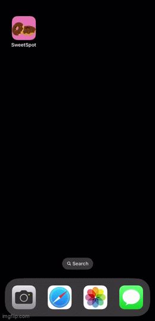

## SweetSpot

*** SweetSpot was built for the Fetch Rewards take home project. 

### Description 
Have a major sweet tooth? SweetSpot is just for you! For chocoholics and dessert-lovers alike, SweetSpot is midnight snacking made easy. 

### Features 
- Looking for a specific recipe? Alphabetically ordered so you can stop scrolling and start baking. 
- Find one that sounds good? Get only the info you really need because... fluff is only good with Oreos mixed in. 
- Need a sneak peak? Check out images to find desserts that taste just as good as they look.  

### Demo 

### Dependencies 
- [The Meal DB Api](https://www.themealdb.com/api.php)

### Technologies 
- SwiftUI 
- MVVM

### License

[MIT](https://choosealicense.com/licenses/mit/)
